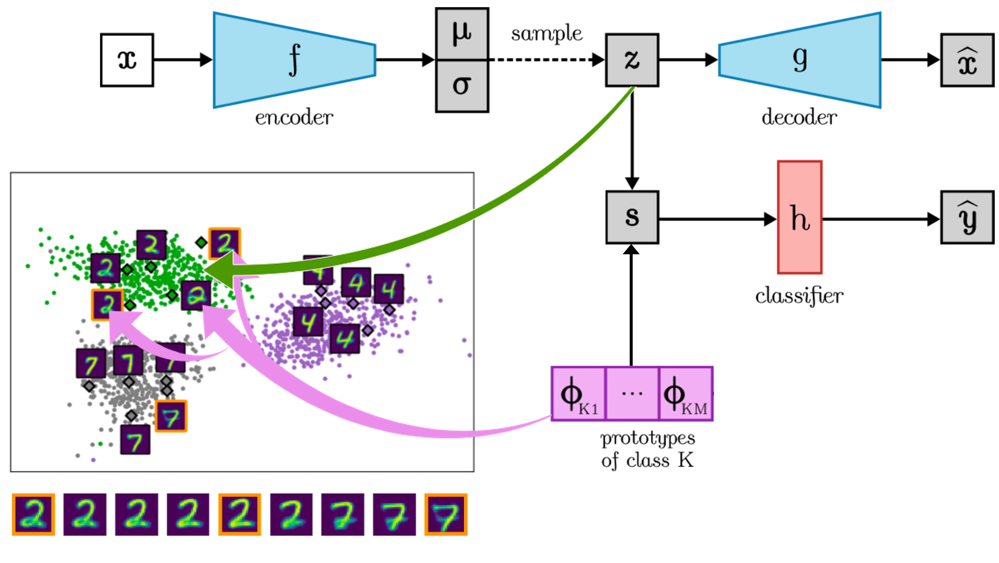

# ProtoVAE



The official PyTorch implementation of "ProtoVAE: A Trustworthy Self-Explainable Prototypical Variational Model" (to appear at NeurIPS 2022) by Srishti Gautam,  Ahcene Boubekki, Stine Hansen, Suaiba Amina Salahuddin, Robert Jenssen, Marina MC Höhne, Michael Kampffmeyer.

The code is built upon ProtoPNet's official implementation (https://github.com/cfchen-duke/ProtoPNet) and LRP implementation from https://github.com/AlexBinder/LRP_Pytorch_Resnets_Densenet.

### Setup

Install a new conda environment 
```sh
conda env create -f requirements.yml
conda activate protovae
```


### Usage

Settings for hyperparameters can be changed in settings.py corresponding to different datasets.
```
Command example: python main.py -data=mnist -mode=test -model_file=saved_models/MNIST/mnist.pth -expl=True
(1) -data: name of the dataset. Supports mnist, fmnist, quickdraw, cifar10 and svhn.
(2) -mode: train/test for training or testing mode respectively.
(3) -model_file: path of the saved model, only required if -mode=test. Produces test accuracy as well as visualization of class prototypes.
(4) -expl: True/False, set True for generating local layer-wise relevance based prototypical explanation maps for 100 test images. Only works when -mode=test.
